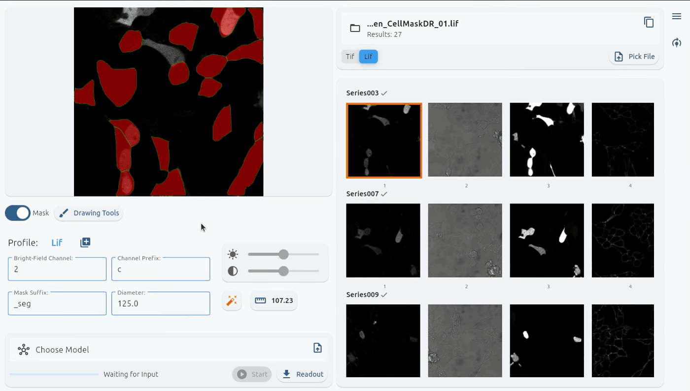
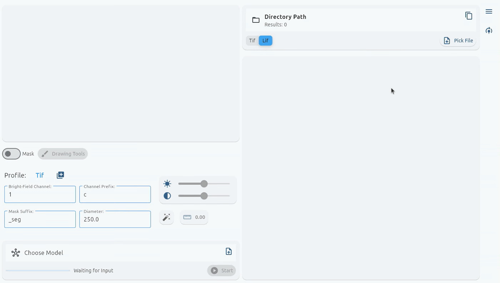

# 🦠 CellSePi – Cell Segmentation Pipeline 🦠

[](https://pypi.org/project/cellsepi/)
[](LICENSE)
[](https://pypi.org/project/cellsepi/)

> **Microscope segmentation and data analysis pipeline with a graphical interface, powered by Cellpose.**

## 🌟 Highlights

- **User-Friendly Interface:** Intuitive GUI for seamless image segmentation.
- **Advanced Segmentation:** Leverages Cellpose models for accurate cellular segmentation.
- **Correction Tools:** Easily refine and correct segmentation results.
- **Fluorescence Readout:** Automatically extract and analyze fluorescence data.
- **Custom Model Training:** Train and fine-tune models with your own data.
- **Batch Processing:** Process multiple images simultaneously.
- **Multi-Format Support:** Compatible with Lif and Tif image formats.
- **Configurable Profiles:** Save and manage processing parameters effortlessly.
- **Adjustable Image Settings:** Fine-tune contrast, brightness, and more.

## ℹ️ Overview

CellSePi is a powerful segmentation pipeline designed for microscopy images, featuring an interactive GUI to streamline your workflow. By leveraging the advanced Cellpose segmentation engine, CellSePi empowers researchers to efficiently process and analyze cellular images.

## 📚 Citation

Our segmentation and models are powered by [CellPose](https://github.com/MouseLand/cellpose) and include additional tools for correction and analysis.

- **Stringer, C., Wang, T., Michaelos, M., & Pachitariu, M. (2021). Cellpose:**  
  a generalist algorithm for cellular segmentation. *Nature Methods, 18*(1), 100-106.
- **Pachitariu, M. & Stringer, C. (2022). Cellpose 2.0:**  
  how to train your own model. *Nature Methods, 1-8.*
- **Stringer, C. & Pachitariu, M. (2025). Cellpose3:**  
  one-click image restoration for improved segmentation. *Nature Methods.*

## ✍️ Authors

Developed by:  
- **Jenna Ahlvers** – [GitHub](https://github.com/Jnnnaa)  
- **Santosh Chhetri Thapa** – [GitHub](https://github.com/SantoshCT111)  
- **Nike Dratt** – [GitHub](https://github.com/SirHenry10)  
- **Pascal Heß** – [GitHub](https://github.com/Pasykaru)  
- **Florian Hock** – [GitHub](https://github.com/PraiseTheDarkFlo)

## 📝 License

This project is licensed under the **Apache License 2.0** – see the [LICENSE](LICENSE) file for details.

## 🚀 Usage

**1. Start the Application**  
Run the following command to launch the GUI:

```bash
python -m cellsepi
```

**Interface Overview**  
*(Left: Start Screen; Right: Main Interface with Images)*  
<p align="center">
  
  
</p>

**Options**  
- The dark/light theme adapts to your system settings. Changing the theme is only for the current session. 
- Mask and outline colors are saved in the configuration file for consistency.


**Profiles**  
Save and manage parameters like the bright-field channel, channel prefix, mask suffix, and diameter.


**Segmentation**  
To start segmentation, select:
- A Lif or Tif file
- A compatible model

If you see:
```text
You have selected an incompatible file for the segmentation model.
```
It means the chosen model isn’t compatible with Cellpose’s segmentation process.

During segmentation, you can:
- **Pause:** Temporarily halt the process (useful for large images) and resume later.
- **Cancel:** Abort the process, reverting to the previous mask or removing it if none existed.


**Readout**  
Generates an `.xlsx` file containing extracted fluorescence values. Click the "Open Excel" button to launch your system’s default spreadsheet application (e.g., ONLYOFFICE).


**Drawing Tools**  
Correct segmentation errors manually or draw masks to train new models.  
- **Cell ID Shifting:** Automatically adjusts mask IDs to maintain a continuous sequence when a mask is deleted.

All changes in the Drawing Tools window are synchronized in real time with the main window.



**Training**  
Train your own models using the **Cellpose** framework. Two training modes are available:
1. **New Model Training:** Train a model from scratch using standard Cellpose models (e.g., `nuclei`, `cyto`, `cyto2`, `cyto3`).
2. **Model Fine-Tuning:** Retrain an existing model with your own images and masks for improved performance.




## ⬇️ Installation

To install CellSePi, simply run:

```bash
pip install cellsepi
```

This command automatically installs all required dependencies as specified in the package configuration. Alternatively, if you prefer to install dependencies manually, you can use the provided `requirements.txt`, by run:

```bash
pip install -r requirements.txt
```

**Required Packages (with versions):**

- **Python 3.8+**
- `numpy==1.26.4`
- `numba==0.61.0`
- `pillow`
- `pandas`
- `openpyxl`
- `cellpose==3.1.1.1`
- `flet==0.25.2`
- `flet-desktop==0.25.2`
- `flet-runtime==0.24.1`
- `matplotlib`
- `pytest`
- `pyqt5`
- `flet_contrib`
- `flet_core==0.24.1`
- `bioio==1.2.0`
- `bioio-lif`

## 💭 Feedback & Contributions

Report bugs or suggest features via [GitHub Issues](https://github.com/PraiseTheDarkFlo/CellSePi/issues)
